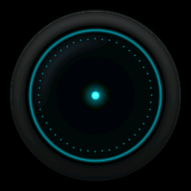
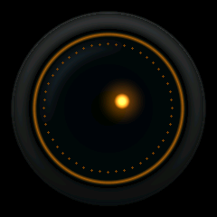

# 实时镜头眼睛 v1

本版上电显示程序绘制的光滑镜筒和玻璃，中心光核固定在上一次主机指定的位置，按配置呼吸，约每 4.5 秒由上下盖板眨眼。单次眨眼约 600ms；上盖板在睁眼时保留少量下压，刚好覆盖蓝色点阵上缘，下盖板仍从原屏幕边缘起步。中心光核还可按心情切换为默认光点、小火苗或爱心，并持续做轻微动态。主机发送方位后下一帧实时更新；圆环、点阵、中心光效均可实时设置，无需设置页面或再次编译。双眼共用片选，画面同步。

默认蓝色及橙色示例来自固件使用的同一份 `EyeRenderer.cpp`：




## 编译和测试

```powershell
& 'C:\Users\Chessle\.platformio\penv\Scripts\platformio.exe' run -e esp32
g++ -std=c++11 -Wall -Wextra -Werror -Isrc tools/test_eye_renderer.cpp src/domain/EyeRenderer.cpp -o test-eye.exe
./test-eye.exe
```

首次使用需烧录新固件，之后仅发送参数。烧录时按实际串口指定端口：

```powershell
& 'C:\Users\Chessle\.platformio\penv\Scripts\platformio.exe' run -e esp32 -t upload --upload-port COM实际端口
```

## 串口命令（115200，换行结束）

先按现有流程完成 `getname:WHO_ARE_YOU` 握手，等固件进入 Ready。键名区分大小写，不允许空格。单次参数体最多 240 个 ASCII 字节；只需提供需要改变的字段。

```text
eyeconfig:query
eyeconfig:color=00E5FF
eyeconfig:color=FF8800
eyeconfig:color=FF8800,ringColor=2244FF,dotColor=00FF88
eyeconfig:brightness=0.8,ringBrightness=0.5,dotBrightness=0.3
eyeconfig:minScale=0.4,scale=1.0,maxScale=1.5,glow=22
eyeconfig:x=15,y=-8
eyeaction:look:x=15,y=-8
eyeconfig:ring=0,dots=0
eyeconfig:ring=1,dots=48
eyeconfig:breathMs=2400,blinkMs=4500
eyeconfig:breathMs=0,blinkMs=0
eyeconfig:mood=dot
eyeaction:mood:flame
eyeaction:mood:heart
eyeaction:mood:dot
eyeaction:blink
eyeaction:zoom
```

`color` 同时设置三层颜色，随后可用 `ringColor`、`dotColor` 覆盖（按从左到右处理）。

成功响应 `EYE:OK` 表示参数已应用或动作已启动，下一次绘制使用新参数；不表示屏幕传输已结束。无效输入响应 `EYE:ERR:invalid_config`，整条拒绝。眼屏不可用时响应 `EYE:ERR:not_ready`。查询返回 `EYE:STATE:...`，包含全部参数与 `ready` 状态。

参数只存 RAM，重启恢复默认，不写 Flash。建议一次发送一条命令、等待 ACK；滑块来源最多发送 10 次/秒并合并中间值。

| 字段 | 范围 | 默认 |
|---|---|---|
| color / ringColor / dotColor | 6 位 RGB 十六进制，无 # | 00E5FF / 00CFE8 / 00BCD0 |
| brightness / ringBrightness / dotBrightness | 0–1 | 0.85 / 0.65 / 0.45 |
| minScale / scale / maxScale | 0.4–1.5，必须 min ≤ scale ≤ max | 0.4 / 1 / 1.5 |
| glow | 光晕半径 8–30 px，随 scale 缩放 | 22 |
| range | 保留的兼容字段；位置由主机命令给出，当前不自动游走 | 0.8 |
| x / y | 光核偏移各 −26–26 px，合成后径向限制 26 px；`eyeaction:look` 会同时关闭自动游走 | 0 / 0 |
| breathMs | 0 关闭，或 500–10000 ms | 2400 |
| blinkMs | 0 关闭自动眨眼，或 1000–15000 ms | 4500 |
| dots | 整数 0–64，0 关闭点阵 | 48 |
| mood | `dot`、`flame`、`heart`（也接受 `normal`、`fire`、`love` 别名） | dot |
| ring / auto | ring 为 0 或 1；auto 只能为 0（保留旧协议键名） | 1 / 0 |

`eyeconfig:mood=...` 和 `eyeaction:mood:...` 都会实时替换中心图形；也可直接发送 `eyeaction:flame`、`eyeaction:heart` 或 `eyeaction:dot`。火焰使用暖色闪烁，爱心使用红色呼吸/脉动，`brightness`、`scale`、`glow` 仍然对三种图形生效。

`zoom` 在 900ms 内依次到达最大、最小尺寸，再回到默认尺寸。眨眼用上下两块与镜筒边缘同色、内侧为直线且整体逆时针旋转 5° 的盖板从圆形屏幕边缘向中心滑入；上盖板从蓝色点阵上缘的默认位置开始，下盖板保持原起始位置，中央光核不会被单独缩放；盖板打开后光效恢复。

## 实现与限制

`EyeRenderer` 不依赖 Arduino，可在电脑上测试。镜头背景和外圈效果在初始化或相关参数改变时缓存；每帧恢复该缓存，再叠加光核，避免拖影。两个 240×240 RGB565 缓存合计 230400 字节，优先使用 PSRAM。

刷新间隔为 33ms（约 30 FPS 目标），通过已有双缓冲 DMA 分块传输，保持现有 SPI3 引脚和频率。DMA 的 `endFrame()` 会等待本帧完成，因此 UI 循环仍承担整帧传输时间；实际帧率、屏幕撕裂及与主屏摄像预览同时运行时的响应需要真机验证。未测试的真机指标不能视为保证。

DMA 不可用时沿用现有同步路径，启动日志会明确警告。传输接口报告失败时停止眼睛刷新并输出错误，查询 `ready=0`，需重启；不静默重试。旧 `eyeimg.h` 保留在仓库以便恢复，本版不再引用它。

## 真机验收

1. 上电确认双眼镜头外观一致，主屏正常。
2. 握手后查询参数，依次切换蓝色、橙色和三层独立配色，检查 RGB 色序。
3. 发送 `eyeaction:look:x=26,y=26`，再设置 `scale=1.5,glow=30`，确认光效不越界、不覆盖点阵。
4. 关闭 ring、dots 后确认旧像素被清除；移动光核无拖影。
5. 触发 `eyeaction:blink`，确认上下盖板闭合而光核不独立缩放；触发 zoom 并观察尺寸往返。
6. 发送 `eyeconfig:color=FF0000,dots=65`，确认整条拒绝、颜色保持原值。
7. 眼睛动画期间操作主屏、串口、PCA9685、摄像预览，观察响应和日志。

## 修改前备份

2026-10-01 修改前执行了 `git fetch origin`，`HEAD` 与 `origin/main` 均为 `90e6ca4`，ahead/behind 为 0/0，已跟踪文件无差异。未跟踪的 `assets/` 一并备份。

备份路径：`E:\walle\wall-e-tft\backups\eye-render-20261001-223627`。

- `repository.bundle`：完整 Git 历史与引用，已通过 `git bundle verify`。
- `working-tree.zip`：修改前工作文件与素材，排除 `.git` 和 `.pio`。

本版在 `codex/realtime-eye-v1` 分支开发，原 `main` 不变。恢复时可将 bundle 克隆到新的目录，再从 ZIP 提取未跟踪素材，避免覆盖现有工作。
